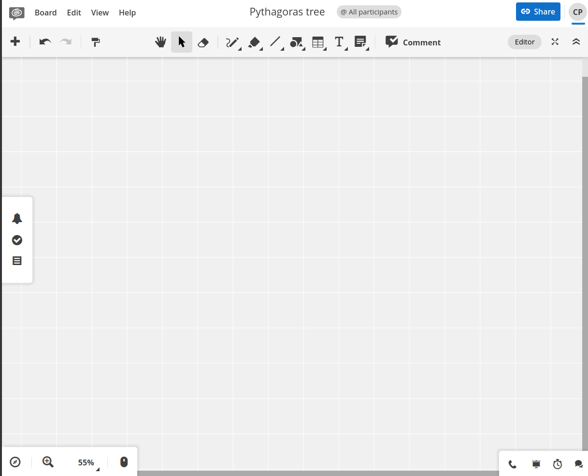

# Conceptboard art



[Conceptboard](https://conceptboard.com) is a proprietary online whiteboard, and I've written a script to generate some pretty art.

Disclaimer: As of 2025, Conceptboard is my employer.

## Run it

Create `.env.local` or set the environment variables in another way. You must get your own from a web browser's network inspector.
```
CONCEPTBOARD_COOKIE="gUsw=…"
CONCEPTBOARD_CSRF="ZDY7…"
CONCEPTBOARD_BOARD_UUID="0552…"
```

To install dependencies:

```bash
bun install
```

To run:

```bash
bun run src/index-pythagoras.ts
```
